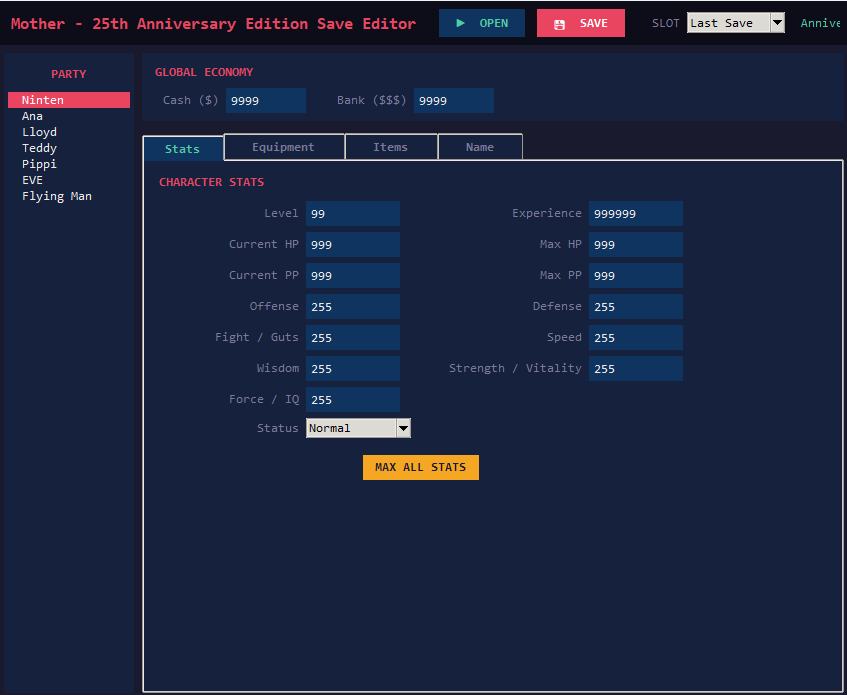

# EarthBound Beginnings Save Editor

A simple desktop save editor for **EarthBound Beginnings (Mother 1 – 25th Anniversary Edition)**.

Built with Python and Tkinter.

---

## Preview



---

## Features

- Open save files (drag & drop supported)
- Edit:
  - Character stats
  - Level & experience
  - HP / PP
  - Status conditions
  - Money & bank balance
  - Equipment
  - Inventory items
  - Character name
- Max all stats button
- Automatic checksum recalculation
- Save changes directly back to file

---

## Requirements

- Python 3.x
- tkinter
- tkinterdnd2

Install dependency:

```bash
pip install tkinterdnd2
